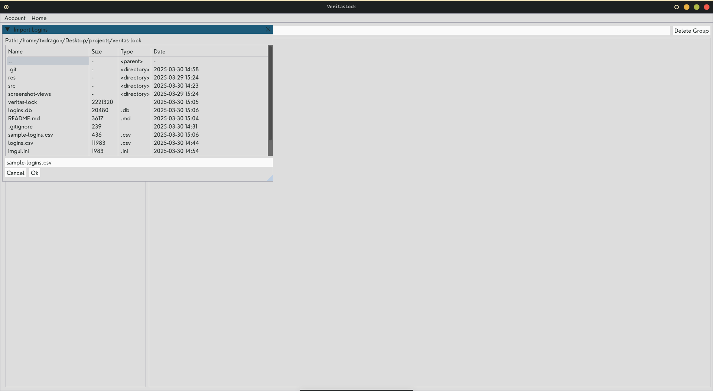

<h1 align="center">Veritas Lock</h1>

Veritas Lock is a local password manager that stores all your passwords for accounts that you use.

## Getting Started
### Build With dependencies

* [![C++][C++]][cplusplus-url]
* [![SQLite][SQLite]][sqlite-url]
* [Imgui](imgui-library)
* [SDL2 Library](sdl2-library)

### Installing on Ubuntu/Debian

1. First check if C/C++ compiler is installed by opening up the terminal and enter the command

		g++ --version

2. If you see a g++ version then you can skip the following steps. Otherwise, continue following the steps below in your terminal

3. Update and upgrade the repositories

		sudo apt update && sudo apt upgrade

4. Install g++

		sudo apt install g++

5. Check g++ version

		g++ --version

6. Install the SDL2 and SQLite3 libraries and Makefile builder by entering the command below in your terminal

		sudo apt install build-essential libsdl2-dev libsdl2-image-dev libsdl2-mixer-dev libsdl2-ttf-dev sqlite3 libsqlite3-dev

Note: The package manager you use will be different depending on which linux system you use. You can find your package manager by searching it on the internet if you don't know then install the libraries.

### Compiling and Using on Ubuntu/Debian

1. Ensure you have installed libraries

2. In this direcotyr enter command below in your terminal

		make

3. Use application via command below

		./veritas-lock

## Features

- Display, Edit and Delete logins
- Import logins from a JSON file
- Export logsn to a JSON file
- Undo deleted logins
- Passwords stored locally in database are all encrypted so it cannot be viewed directly in the database
- Only need to remember your master password to access login details for all your accounts

## Views

### 1) Master Login

### 2) Home

### 3) Search

### 4) Add Login

### 5) Trash

### 6) Import Logins

### 7) Edit Login

### 8) Multiple Users

### 9) Multiple Groups

## Sample of CSV file containing login details to import in application

	account,type,username,email,password,notes,website,user
	Google,personal,johnsmith,johnsmith@gmail.com,P@ssw0rd123,"Primary email account",https://www.google.com/intl/en-US/gmail/about/,John Smith
	Microsoft,work,jsmith,john.smith@company.com,SecurePass!456,"Work account",https://login.microsoftonline.com/,John Smith
	Facebook,personal,janedoe91,janedoe91@hotmail.com,FbSecure987,"Social media account",https://www.facebook.com/,Jane Doe

### Limitations

Using login details with commas `,` will make importing and exporting CSV files not possible as the application is set to use commas as the delimiter.

[C++]: https://img.shields.io/badge/C++-FFFFFF?style=for-the-badge&logo=cplusplus&logoColor=00599C
[cplusplus-url]: https://sourceforge.net/projects/mingw-w64/files/Toolchains%20targetting%20Win32/Personal%20Builds/mingw-builds/installer/mingw-w64-install.exe/download
[SQLite]: https://img.shields.io/badge/SQLite-FFFFFF?style=for-the-badge&logo=sqlite&logoColor=003B57
[sqlite-url]: https://www.sqlite.org/index.html
[imgui-library]: https://github.com/ocornut/imgui
[sdl2-library]: https://www.libsdl.org/download-2.0.php
